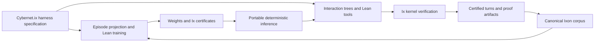

# Cybernet.ix

Cybernet.ix is a proposed Lean 4 library for certified model training,
portable deterministic inference, and orchestration. It supports System One
inference over typed Ixon data, specialized autoformalization models, and a
path to general models at frontier scale. Training and the interaction harness
share one semantic foundation.

The design brings together four ideas:

- **Ixon as the corpus and artifact format.** Canonical terms, source metadata,
  model definitions, weights, and interaction histories have stable identities.
  Models consume readable projections of these objects with resolved names.
- **Lean 4 as the language for training and its correctness proofs.** Training
  specifications, numerical semantics, and implementations are developed
  together. Certified compilation connects model computations to accelerated
  implementations through explicit preservation theorems and checked artifacts.
- **A new harness shared by learning and execution.** Cybernet.ix defines the
  states, observations, actions, responses, rewards, and episode semantics
  that both its trainer and its runtime use. Ant.ix's AgentM proofs and
  Lane/Pantograph's Lean interfaces are precedents for this design.
- **Ix as the verification and certificate layer.** Checked proofs become
  portable Ix certificates attached to programs, model releases, and turns.

The central claim to make precise is: **these weights follow this specified
training computation, and this turn follows this specified model and
interaction program.** Program correctness, evidence for a particular run,
and correspondence between informal intent and a formal statement are distinct
obligations.

The harness is also a training object: its observations and actions define
what the model learns, and its checked episodes become the next corpus. Training
and orchestration belong to one semantic design.

**The same model and complete input must produce identical output bytes on
every conforming backend.** Arithmetic, reductions, tokenization, structured
prediction, and decoding belong to the model specification. Batch neighbors,
cache use, and device scheduling cannot change the answer.

System One describes a typed prediction interface, not a model size. Start
implementation with an exact toy run, a 7,850-parameter MNIST classifier,
a small MLP, and a sub-million-parameter Transformer. Later reference designs
include a 44M encoder, 1.13B and 7.11B dense provers, and a 131B-total sparse
general model. These are proposed configurations, not trained releases.

- [Implementation roadmap](docs/roadmap.md): small-model progression informed
  by lean4-mlir, concrete milestones, proof obligations, and resource gates.
- [First-principles design](docs/design.md): harness, corpus, and certificate claims.
- [Model architecture](docs/model-architecture.md): typed prediction, concrete
  networks, learning objectives, and resource requirements.
- [Portable inference](docs/portable-inference.md): bit-level semantics,
  backend equivalence, and the PTXLean/Compilatr.ix compilation direction.
- [Source notes](docs/research-notes.md): inspected foundations and remaining gaps.
- [Development](docs/development.md): the Lean/Rust FFI scaffold, Nix packages,
  and build checks.

Start development with `nix develop`, then `lake build` and `lake test`.
`nix flake check` builds and checks the linked Lean/Rust scaffold.

Status: architecture design and initial build scaffold, September 2026.
Model, harness, and certification implementations remain to be developed.
The [earlier 120B model sketch](verified-120b-v2.md) is
retained as research material; its arithmetic, scale, and assurance claims are
not adopted as requirements.

Cybernet.ix names the AI library. Ant.ix's VM infrastructure and the obsolete
blockchain whitepaper are outside this design. A later application can anchor
certified turn commitments on a blockchain without making consensus part of
the library.
