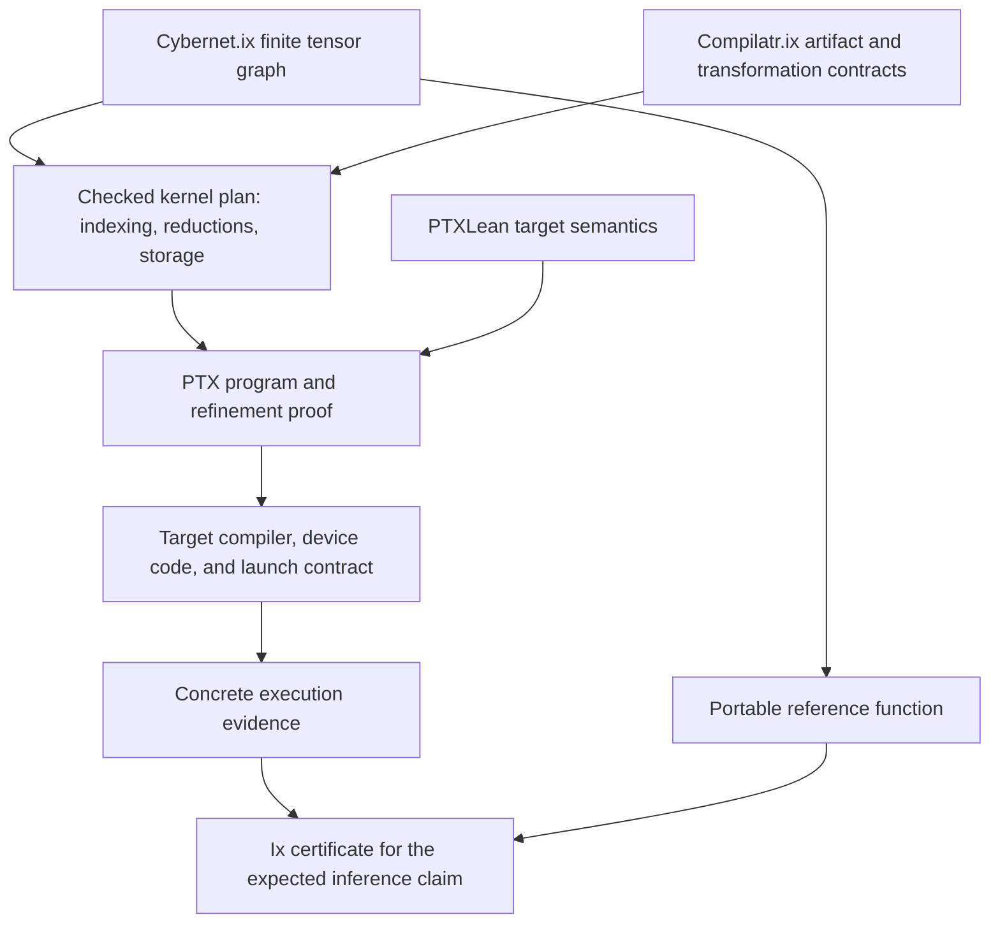

# Portable deterministic inference

Proposed contract, 2026-09-26. This is a requirement on Cybernet.ix models and
backends, not a claim that an implementation already satisfies it. It applies
to System One predictions, autoregressive models, and their composition in
the [shared harness](design.md).

## 1. The model denotes a portable function

For a fixed model release and complete request, every conforming backend must
produce identical semantic output bytes. Hardware, thread scheduling, batch
neighbors, device partitioning, and cache use are implementation choices; they
cannot change a successfully computed answer.

The proposed reference relation is:

```text
reference(model, request) : Except SemanticError Result

Conforms(backend, profile) ->
  completes(backend, model, request, result) ->
  result = reference(model, request)
```

Equality includes finite scalar bit patterns, selected token/candidate IDs,
structured values, stopping reason, and random-tape cursor. Semantic errors
are deterministic results too. Physical timing, device telemetry, and server
availability are recorded separately. A backend can fail to complete; it
cannot silently change arithmetic to manufacture a successful result.

Two conforming backends consequently agree even if one uses a CPU and the
other a GPU, or if a later implementation uses different hardware. The theorem
is about conformance to one function, rather than enumerating all hardware
pairs. Ordinary tests provide evidence of conformance but are not this proof.

### Complete semantic inputs

| Artifact or field | What it fixes |
|---|---|
| Model manifest | Graph, parameter sharing, weights, numeric profile, positional constants, supported shapes, and output heads. |
| Input/view manifest | Tokenizer and rendering versions, exact input bytes or typed input values, symbol registry, and local reference table. |
| Query and output specification | Typed question/schema, candidate identities, conditional field graph, grammar constraints, and result encoding. |
| Context | Logical positions, attention masks, retrieved artifacts, task state, and any previous observations the model sees. |
| Decode specification | Greedy or sampling rule, tie order, numeric thresholds, stop conditions, and token/structure limits. |
| Random state | Explicit tape or an identified deterministic generator with its key, counter, domain separation, and draw indexing. |

These identities become subjects of the inference claim and the surrounding
turn certificate. Backend version belongs in provenance, not in the semantic
inputs as an escape hatch for different answers. A changed numerical profile
or quantized checkpoint is a different model release. Equal answers across
such releases require an additional theorem; they are not implied.

At harness level, the reproducible input also includes tool responses and
retrieval results. Replay of a fixed observation history must reproduce the
same decisions. A live tool can return changed information; that creates a
different input. A model's portable inference theorem cannot make an external
world deterministic.

## 2. Initial numerical choice: portable binary32

Choose a profile provisionally named `P32`: explicit IEEE-style binary32 bit
semantics for weights, activations, scalar operators, and intermediate
rounding. Use a pure Lean bit representation for the reference implementation.
Evaluate FloatLib as its first arithmetic dependency, with a pinned revision
and audited theorem dependencies before adoption.

The choice preserves familiar Transformer operations and connects to existing
floating-point proof work. It avoids making a new fixed-point architecture
and its training stability prerequisites for the first experiment. The earlier
120B arithmetic proposal remains a separate research direction.

Lean's native floating-point types alone do not define this contract: the
reference manual explicitly describes platform-dependent behavior and their
replacement by native implementations during execution.
[Lean floating-point reference](https://lean-lang.org/doc/reference/latest/Basic-Types/Floating-Point-Numbers/).

### Scalar semantics

The initial profile requires:

- Round to nearest, ties to even for conversions and primitive arithmetic.
- Specified binary32 addition, subtraction, multiplication, division, and
  square root, including gradual underflow and signed-zero rules.
- No implicit multiply-add contraction, reassociation, reduced-precision
  multiply, flush-to-zero, or fast-math transformations. An explicit fused
  primitive would require a different graph; the initial graphs do not use it.
- Constants stored as bit patterns, or obtained by the specified rounding of
  an exact rational. A host parser must not choose their values.
- Finite validated model/input scalars. Nonfinite intermediate results produce
  a typed numerical error under the graph's specified evaluation semantics.
  NaN payloads or host exception timing cannot affect serialized results.
- Canonical byte encoding, with tensor element order and little-endian scalar
  words fixed in the artifact schema, independently of machine endianness.

For parallel evaluation, identify semantic errors by logical graph node and
element order, not by the first device to report one. A reference evaluator
may stop at the first error in that order; an accelerated evaluator must
return the same error. Wall-clock timeout is a separate operational failure.

These rules are deliberately stricter than requesting IEEE arithmetic from a
backend. The graph must identify every rounding boundary as well as the
operators themselves.

### Elementary functions and positional tables

`exp` and `log` are identified pure finite programs with pinned coefficients,
tables, range-reduction rules, and rounding. They are not calls to whichever
host or device math library happens to be installed. The initial implementation
should select and pin the corresponding FloatLib approximation programs after
checking their domain coverage; a release cannot leave this selection open.

FloatLib distinguishes executable approximations from correctly rounded
elementary-function results established under particular conditions. Our first
obligation is to execute the selected finite program identically. Its error
bound relative to the real exponential or logarithm is a separate theorem,
with coverage recorded per operator.
[FloatLib arithmetic and proof interfaces](https://github.com/lean-dojo/FloatLib).

`P32` in this document is a profile design. Its first executable version must
contain actual primitive-program roots and constants before any model release
can name it. A phrase such as “deterministic exp” is insufficient to identify
that version. A changed approximation changes its numerical identity.

RoPE uses addressed tables of binary32 sine/cosine values indexed by logical
position and head coordinate. Every backend loads the same table values;
it does not regenerate them through local trigonometric intrinsics. Generation
method, theta, supported positions, and approximation claims are recorded.
The table's execution identity and its accuracy relative to ideal RoPE are
distinct obligations.

Use a stable explicit sigmoid for SwiGLU: for `x >= 0`, compute
`1 / (1 + exp(-x))`; otherwise compute `e / (1 + e)` with `e = exp(x)`.
Multiply by `x` for SiLU, with each indicated operation rounded under `P32`.
This fixes an executable choice instead of treating all real-equivalent
sigmoid formulas as interchangeable.

## 3. Reductions are part of the network

Each reduction has a logical ordered axis. Pad its leaves to the next power
of two with positive zero and reduce adjacent pairs in a balanced binary tree,
rounding each internal addition to binary32. A singleton returns its leaf;
the empty sum is positive zero where the operator permits an empty axis.
Nonempty normalization and softmax domains are checked explicitly.

For a matrix product:

```text
product[k] = mul32(A[i,k], B[k,j])
C[i,j]     = canonicalTreeSum(product[0 .. K-1])
```

Thus each product is rounded before summation. Partitioning the output rows
or columns is straightforward. Partitioning the reduction dimension must
preserve exactly these tree nodes and rounding boundaries. A hardware tile
size cannot select a new mathematical reduction order.

This is an implementable parallel specification, but it restricts optimized
matrix libraries. A conventional fused dot product, an arbitrary all-reduce,
or an exact accumulator with one final rounding generally denotes a different
function. Such an implementation needs an equality proof or a separately
versioned numerical profile. An error tolerance alone does not establish
portable identity: a tiny logit difference can change a discrete choice.

### Normalization and attention

For RMSNorm, square each component, apply the canonical sum, divide by the
specified conversion of the dimension, add epsilon, apply the specified
square root and reciprocal, then multiply each component and learned scale
in the graph's declared order. Do not substitute an approximate `rsqrt`
instruction without a refinement proof.

For softmax:

1. Select the maximum among valid elements with canonical index tie-breaking.
2. Subtract it with specified rounding and evaluate the pinned `exp` program.
3. Sum the exponentials using the canonical tree over valid logical indices.
4. Divide each exponential by that sum using specified rounding.

Masks are boolean structure, not accidental infinities introduced by a
device-specific kernel. An empty valid set returns a specified error. Invalid
positions do not change the reduction length. The resulting finite values
need not sum to exactly one; consumers must use the declared probability and
sampling interpretation.

Attention computes QK, scale, mask, softmax, and PV in their specified order.
The PV reduction multiplies the individually rounded probabilities by V and
uses the same tree rule. Tiling can avoid unnecessary materialization, but
online rescaling or a fused attention algorithm must preserve this exact
function. Real-valued equivalence of two attention formulas is insufficient.

This makes the first performance experiment concrete: benchmark conforming
matrix products, normalization, and attention against the ordinary accelerated
baseline, including witness costs. Portability is a requirement; competitive
throughput under that requirement is a hypothesis to test.

## 4. Serving transformations must preserve the function

### Batching and padding

For independent requests, evaluating a packed batch must agree with evaluating
each request separately, after restoring request order. Neighboring requests,
padding length, scheduler arrival order, and microbatch size cannot change a
request's logical positions or reduction tree.

For causal attention at position `t`, the valid key sequence is the ordered
logical prefix allowed by its mask. A longer padded batch must not add leaves
to this sequence. For System One queries, each head's candidate or field
domain is fixed by its query. Canonical candidate IDs fix both the score
vector order and tie-breaking.

Batch invariance is a substantive kernel obligation, even for nominally
deterministic inference. The Thinking Machines investigation identifies how
batch-dependent kernels alter reductions and model outputs; our additional
requirement is agreement across conforming hardware implementations too.
[Batch-invariant inference](https://thinkingmachines.ai/blog/defeating-nondeterminism-in-llm-inference/).

### Caches and incremental decoding

A KV cache binds the full model and numerical identity, prefix tokens,
positions, masks, and table versions. Prove that cached incremental evaluation
agrees with recomputing that prefix. Full prefill, chunked prefill, and one-token
decoding must use the same logical operations and reductions for each output.
Prefix reuse validates the prefix identity; a cache hit cannot bypass that
condition.

Candidate-embedding and state-encoding caches have the analogous obligations.
Quantized cache storage is a distinct graph/profile unless a lossless encoding
relation is established. A corrupted or stale cache cannot become an accepted
inference witness merely because its metadata looks correct.

### Mixture of experts and distribution

Expert selection depends on a token's router values and canonical expert IDs.
The graph has no batch-dependent capacity dropping. A placement plan may move
experts between workers; it preserves selected experts, their computations,
and the reduction of their weighted outputs. Pipeline order, message arrival,
and worker count cannot alter successful semantic results.

For structured System One heads, the schema defines dependencies between
field predictions. Only independent nodes may be reordered. Parallel execution
does not authorize replacing a declared joint distribution with a product of
marginals.

## 5. Decoding and probabilities

Default generation is greedy, with equal logits resolved by the smallest
permitted token ID. Typed choices use stable candidate IDs, not arrival order.
The decode specification fixes masks, EOS handling, maximum generated tokens
or structure size, stopping reason, and byte serialization. A structured
result assembled directly as Ixon has an equally specified encoding.

Schema constraints act on the declared domain. Grammar-constrained token
generation and type-directed field generation have different output
specifications, even if they ultimately produce the same Ixon value. The
harness records which policy made the proposal and the likelihood semantics
used by its trainer.

### Reproducible stochastic inference

Support sampling as a deterministic function of explicit random input. The
first sampling interface consumes a tape of unsigned 64-bit words. A seed-only
API is added only with a pinned generator algorithm and precisely defined
draw indexing. Dropout, sampling, initialization, and other uses have separate
domains; thread scheduling never determines which draw a token receives.

Use this concrete categorical rule over nonnegative finite weights:

1. Interpret weight bit patterns as exact rationals and normalize by their
   exact sum. Reject a zero sum or invalid weight.
2. Allocate `2^64` integer bins proportionally: take floors, then assign the
   remaining bins by descending fractional remainder, breaking ties by
   canonical outcome ID.
3. Read one tape word and select its interval in canonical outcome order.

Bin counts and cumulative endpoints use sufficiently wide integers, including
the endpoint `2^64`. This makes the finite sampling distribution explicit and
reproducible; it approximates the normalized weights. It is not identical to
an ideal real-valued softmax. Sampling theorems state the probability assumption
on tape words separately from determinism on a given tape.

The initial sampler uses the full allowed categorical domain. Temperature is
an explicitly positive numeric input when enabled. Later top-k or nucleus
sampling requires specified ordering, threshold arithmetic, and boundary
rules. Draws for structured heads are indexed by query, field path, and
expansion step so parallel execution cannot exchange them.

For RL, keep the actual sampled sequence or structure and the distribution
that selected it. The ideal real policy, rounded weights, and integer-bin
policy are distinct mathematical objects. Their log-likelihoods or gradient
estimators cannot be substituted silently.

## 6. Proof obligations and executable evidence

The proof plan proceeds from small arithmetic to a whole policy:

| Obligation | Result |
|---|---|
| Scalar refinement | Each executable primitive matches the chosen bit-level specification. |
| Tensor refinement | Indexing, shape checks, layouts, and reduction implementation preserve graph semantics. |
| Operator composition | Transformer blocks, schema heads, and sparse routing compute the reference graph. |
| Serving equivalence | Batching, cache use, prefill/decode, and supported placements preserve outputs. |
| Decode correctness | Selection, sampling, stopping, and serialization follow the pinned output policy. |
| Concrete inference witness | The particular request/output pair is related by that model's reference computation. |
| Harness composition | The inference result is admitted and used according to the turn's expected state, authority, and budget. |

Program refinement supports many runs; a certificate for a particular result
still needs a link to the computation that produced it. For the tiny model,
start with direct checked evaluation or a concrete execution proof. At scale,
develop compositional witnesses or sound computation checkers and measure
their cost. Recording tensor hashes is not a substitute for that relation.
Any probabilistic checker needs an explicit soundness bound and challenge
model, independently of inference being deterministic.

The first acceleration target is one strict GPU backend behind Lean/C or
Lean/Rust interfaces, compared with the pure reference and a CPU implementation.
Use software primitives where hardware operations cannot satisfy the contract.
Compilation, foreign execution, and hardware assumptions remain explicit in
the claim policy until their refinement or checking path is supplied. A backend
passing examples is a tested implementation, not automatically a certified one.

TorchLean illustrates why the boundary matters: its documentation separates
real-valued AD, backend contracts, and same-GPU deterministic execution. That
last guarantee does not establish portability across GPU architectures or
toolchain versions.
[TorchLean trust boundaries](https://github.com/lean-dojo/TorchLean/blob/main/docs/TRUST_BOUNDARIES.md).

### Certified compilation: PTXLean and Compilatr.ix

Make checked compilation an explicit part of the backend design. The first GPU
target to investigate is NVIDIA PTX, using PTXLean's instruction and execution
semantics where its supported fragment matches our needs. CPU and later GPU
targets continue to implement the same target-independent numerical function.

PTXLean's current scalar ReLU example connects separately rounded binary32
operations, instruction runs, and a TorchLean forward/backward computation.
It is early work with restricted memory and synchronization support. Its
example uses sequential single-thread launches; it does not establish a
parallel Transformer backend or execute GPU benchmarks.
[PTXLean overview](https://github.com/lschiemanowski/ptxlean/blob/5e1db82fc6f953882c7a538d11798cbf95415e43/README.md).

Compilatr.ix's useful contribution here is its compiler contract: addressed
source and IR artifacts, semantic preservation between stages, and bounded
checking of proposed transformations. A producer can use heuristics or learned
search while the accepted optimization carries evidence for its exact input
and output. Its delivered native support covers selected source/CFG families;
floating-point and GPU support are extensions.
[Compilatr.ix compiler design](../../Compilatr.ix/docs/compiler-design.md),
[current scope](../../Compilatr.ix/docs/roadmap.md).

The proposed connection is:



Define a `KernelArtifact` that binds source graph, numerical profile, shape
domain, layouts, actual target program, target-specification version, ABI,
launch plan, and proof dependencies. Its representation relation fixes how
tensor elements correspond to bytes in buffers. Check alignment, bounds,
aliasing/ownership, allowed effects, and synchronization alongside arithmetic.
The kernel plan must preserve the declared reduction tree and all rounding
points. Evidence about an earlier graph cannot certify a later fused kernel.

Use the Compilatr.ix pattern for a sound `checkLowering` interface: acceptance
establishes refinement for the identified program and stated input domain.
Start with hand-authored kernels and explicit proofs, then add translation
validation and reusable lowering theorems. Rejected optimizations retain a
previously checked implementation or fall back to the reference evaluator.
Reusing that pattern does not assume Cybernet.ix tensor graphs already lower
through Compilatr.ix's current Ixon/ownership fragments.

The key PTX theorem must cover **every permitted completed execution**, not
just exhibit one schedule that returns the expected answer. Race freedom,
memory visibility, and schedule-independent reductions must combine to imply
one observable result. Prove completion under stated resource/progress
conditions separately, avoiding a vacuous correctness statement for a kernel
that never finishes. If a target instruction allows results wider than `P32`,
restrict its use with proved conditions or implement a conforming operation.

PTX is a virtual target. Its translation to device instructions, the runtime
launch/transfer boundary, and hardware conformance remain distinct obligations.
Pin the downstream compiler, options, target, generated code, and launch ABI
as provenance. They do not change the reference function. Record any still
assumed preservation premises until a binary-level proof, sound validation,
or execution-checking route replaces them. PTXLean itself explicitly separates
its modeled launch contract from a real runtime and hardware.
[ReLU proof scope](https://github.com/lschiemanowski/ptxlean/blob/5e1db82fc6f953882c7a538d11798cbf95415e43/docs/foundations/relu-neuron.md).

The first compilation experiment should progress through:

1. A scalar multiply/add kernel matching our finite primitives, with exact
   input/output byte binding and explicit launch conditions.
2. A canonical reduction and small matrix product, adding thread cooperation
   and proving agreement for all permitted schedules.
3. RMSNorm, softmax, and one dense Transformer block, preserving the same graph
   through caching and supported batching changes.

Measure hardware agreement, proof checking, and throughput at each step.
Backward kernels and optimizer updates then reuse the compilation interface.
Kernel construction can itself become an autoformalization task in the shared
harness: a model proposes code and evidence, and a pinned checker decides
whether the proposal preserves the requested finite computation.

### Conformance suite

Publish bit-exact fixtures for scalar edge cases and whole operators, then
compare complete model outputs across CPU and GPU. Exercise signed zeros,
subnormals, halfway rounding, ties, masking, invalid domains, and numerical
errors. Vary batch neighbors, padding, candidate order, prefill chunk sizes,
cache hits, device partitioning, and thread schedules. Include deterministic
random tapes and verify returned cursors.

The proof target quantifies over valid inputs; fixtures catch implementation
mistakes and protect known cases. Release evidence records exactly which
obligations are proved, tested, or assumed. A portable certified release must
meet the consumer's conformance and concrete-execution policy, not merely
advertise a deterministic runtime flag.

## 7. Training and later numerical profiles

Training uses the same finite forward graph when claiming to train the deployed
model. Its backward graph and AdamW state transition specify their own rounding
and reduction rules. Tie gradient contributions to logical example, token,
parameter, and graph-node indices. Loss normalization, clipping, gradient
accumulation, and optimizer updates use fixed logical batches, independent of
physical microbatching. Optimizations that round per-microbatch gradients
before combining them need an equivalence proof or a changed training plan.

Portable inference is the first requirement. Portable replay of a full training
run additionally fixes initialization, data order, random inputs, all backward
operations, and optimizer state. Training certification can identify that exact
program before every distributed topology is supported; it must not claim
topology-independent replay without proving the additional relation.

The next performance profile to investigate is BF16 storage and explicit
casts with specified binary32 accumulation. Its cast locations, multiplication
semantics, reduction trees, and final rounding must be fully defined. It is a
new numerical profile with its own conforming backends, not a “fast” switch
that changes a `P32` model behind the same identity. The same rule applies to
INT8/fixed-point quantization or exact superaccumulators.

Every profile keeps the portable-function contract. Larger models may motivate
a different arithmetic choice, but resource pressure cannot silently weaken
“same inputs, same outputs” to “approximately similar logits.”
