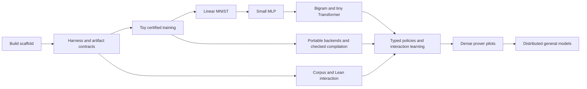

# Cybernet.ix implementation roadmap

Draft, 2026-09-26. This document owns implementation order and milestone
acceptance. The [design](design.md) defines the shared learning/harness model;
[model architecture](model-architecture.md) defines the longer-term networks;
[portable inference](portable-inference.md) defines the numerical contract.
The development scaffold and the first certified SGD slice are implemented;
[certified SGD](certified-sgd.md) records the exact proof coverage. M1's Ix and
harness integration, the rest of M2, and subsequent milestones remain open.

Start with an exact toy training run and **MNIST linear classification**, then
a small MLP, a byte-level language model, and a tiny Transformer. Build the
artifact, harness, and certificate interfaces through those examples. The
44M System One encoder and billion-parameter provers become later experiments
with measurable entry conditions.

The first useful result should fit on a development machine: train a model
from Lean, save its identified weights, reproduce its predictions, use them
in a typed Cybernet.ix episode, and independently check precisely scoped Ix
claims. A complete training-run certificate starts with the toy computation.
Extending that certificate to an entire MNIST run is a separate cost and
coverage milestone, not something established by achieving good accuracy.

## 1. What lean4-mlir contributes

Reviewed the source at
[`373059db8e0a32f2af15b27f9e2a4ed8175eece3`](https://github.com/brettkoonce/lean4-mlir/tree/373059db8e0a32f2af15b27f9e2a4ed8175eece3).
This was source inspection, without building its proof suite or reproducing
its training results. Its inspected Lean and Mathlib pins are 4.34.0; this
repository currently follows Ix at Lean 4.33.1. Its reported runtime or
accuracy numbers are not Cybernet.ix measurements.

### The examples worth studying first

| Upstream example | Concrete scope | Cybernet.ix use |
|---|---|---|
| [Linear MNIST][up-linear] | One `784 → 10` dense layer, softmax cross-entropy, SGD; its entry point requests 12 epochs and batch 128. | First real dataset and first useful finite-choice System One instance. |
| [MLP MNIST][up-mlp] | `784 → 512 → 512 → 10`, ReLU, softmax cross-entropy. | Reference for layer composition and backward correctness; start with a smaller network here. |
| [CNN MNIST][up-cnn] | Two convolutions, ReLU, pooling, and a dense head. | Optional test of spatial operators and nondifferentiable selection after the MLP. |
| [Character bigram][up-bigram] | A 65-character vocabulary and a single dense next-character predictor. | Cheap transition from classification to sequence data, generation, and sampling. |
| [TinyGPT][up-tinygpt] | The `nano` configuration has four width-64 blocks and context 64; `tiny` has six width-128 blocks and context 128. | Evidence that the language-model integration experiment can be far below a billion parameters. |
| [Blackjack DQN][up-blackjack] | A `29 → 64 → 64 → 2` policy-value network, replay, and an exactly evaluated finite environment. | Later reference for interaction learning and separating reward semantics from the neural update. |

The small verified MNIST models share definitions in
[`Verified/NetsCore.lean`][up-nets]. A trainer and its corresponding theorem
refer to the same network object. Adopt that discipline: the model, loss,
optimizer, preprocessing, and numerical profile in an experiment must be the
objects named by its correctness claims.

The [linear training theorem][up-linear-step] connects emitted graph
denotations to the real softmax-cross-entropy gradient. The
[linear renderer tie][up-linear-fold] explicitly scopes its training result
to a single example; it does not itself establish the emitted minibatch
contraction. Cybernet.ix must prove the actual batch objective and its
reduction schedule as well as the single-example calculus.

The [float bridge][up-float] provides rounding-error arguments under stated
hypotheses, including a particular summation order. Its inspection is useful
for numerical analysis, but this is a different obligation from implementing
our executable binary32 profile. The [proof guide][up-proofs] retains trusted
boundaries around floating execution, op/text correspondence, lowering, and
the runtime/FFI. The demos also have different proof coverage: a demo's use
of the same library does not automatically inherit every MNIST theorem.

### Adoption decisions

- Use the small-model progression and shared-definition pattern immediately.
- Evaluate narrow calculus and graph-proof reuse after resolving Lean/Mathlib
  compatibility and auditing the exact theorem dependencies and hypotheses.
  Preserve upstream attribution and license terms for any copied work.
- Keep the Cybernet.ix experiment and harness definitions authoritative.
  Do not import a large upstream trainer as the definition of our runtime.
- Consider StableHLO/XLA or IREE as an explicitly scoped experimental backend
  for comparison. Their presence does not establish our portable profile.
  An adapter that changes reductions or arithmetic identifies a different
  numerical experiment until exact refinement is established.
- Use coarse numerical calls across FFI: a tensor operation, graph segment,
  or training step. A host-language call for every scalar would defeat the
  purpose of the accelerated backend. Measure buffer transfers separately.

PTXLean and Compilatr.ix remain the route to investigate for checked kernel
compilation. Their role is complementary to lean4-mlir's training examples;
the existing [source notes](research-notes.md) describe their current scope.

## 2. Current foundation and fixed principles

### M0 — development scaffold: implemented

The repository is a colocated, Git-backed Jujutsu repository. The
[development guide](development.md) describes the Ix-derived Nix flake,
pinned Lean/Rust toolchains, Crane-built Rust archive, Lake integration, and
compiled FFI smoke executable.

The scaffold was validated on x86-64 Linux with Lake and Nix. Its checks
exercise Lean/Rust linking and object ownership, byte encoding, clippy, and
Rust formatting. Other declared Nix platforms remain untested.

The first training implementation now adds a shared two-feature regression
definition, real minibatch-gradient and conditional descent proofs, an exact
SGD run/checker, and a pure binary32 reference. Kernel proofs establish the
toy final state and agreement of all nine finite parameter checkpoints with
the exact run. The default build includes the proofs and axiom audit; tests
cover replay, claim rejection, encoding, and native binary32 comparisons.
Ix export, model certificates, and the common harness are still pending.

### Principles that govern every milestone

1. **One definition serves execution, learning, and proof.** An episode's
   observation/action meaning and training projection come from one harness
   specification. Mathematical and finite interpretations name the same
   graph structure, with their differences made explicit.
2. **Portable inference means exact output bytes.** A backend must implement
   the identified reference function. Device identity cannot excuse different
   successful outputs. This applies to scores and distributions as well as
   the selected label, token, or structured value.
3. **A claim has a subject and a scope.** A real gradient theorem, a backend
   refinement, and evidence that particular weights follow a particular run
   are separate artifacts. Tests and model quality are further evidence of
   different kinds.
4. **Small models use the eventual interfaces.** MNIST predicts `Fin 10`;
   that is one supported output schema. System One remains the general typed
   probabilistic interface, including richer schemas and larger backbones.
5. **Lean owns the program.** Rust/C supply storage, parsers, and numerical
   execution behind declared interfaces. The core training and inference
   workflow does not require Python.
6. **Scale follows measured gates.** Bigger networks, GPU backends, and
   compressed execution evidence are independent work items. Their costs
   must be measured before treating a large certified run as feasible.

## 3. Implementation sequence

| Milestone | Main artifact | Acceptance gate |
|---|---|---|
| M0: build | Lean library, Rust FFI, Nix packages | Linked smoke test and build checks pass on the current host. Done. |
| M1: common semantics | Minimal harness, manifests, typed prediction, Ix claim checker | One recorded episode and its training projection agree; an independently checked claim binds the expected proposition. |
| M2: numerical and training core | Tiny tensor graph, arithmetic subset, SGD toy, concrete run witness | Initial SGD proofs and toy binary32 run implemented. Full `P32` subset, Ix export, and training/inference/turn integration remain. |
| M3: linear MNIST | 7,850-parameter classifier, dataset pipeline, batched SGD | Reproducible predictions, useful held-out accuracy, actual batch-gradient proof, and measured evidence cost. |
| M4: MLP and graph composition | 101,770-parameter MLP and compositional backward pass | Useful accuracy, correct sharing/gradient accumulation, declared ReLU backward convention, and preserved numerical semantics. |
| M5: small language models | Byte bigram and 426,624-parameter causal Transformer | Correct sequence losses, portable decoding, and cache/padding equivalence on the supported reference graph. |
| M6: autoformalization loop | Bounded Ixon corpus, Lean tools, checked proof episodes | Corpus projections round-trip; fixed-target proof success produces the expected Ix-checked artifact. |
| M7: learned typed actions and RL | Small structured policy, then optional 44M encoder; specified policy update | Useful choices under fixed budgets, valid structured outputs, and rewards/likelihoods tied to actual episodes. |
| M8: dense prover | Prover-1B pilot, then Prover-7B if justified | Data quality, learning curves, portable backend throughput, and explicit certification coverage justify the run. |
| M9: distributed general models | Distributed dense and sparse execution/training | Exact placement/routing semantics, viable evidence costs, broader evaluations, and funded resources. |

M6's bounded corpus and tool work can begin once M1 supplies the common
interfaces. It need not wait for a Transformer. The CPU/GPU compilation work
starts from M2's numerical specification and develops alongside M3–M5.

These are dependency and evidence gates, not calendar promises. A milestone
can produce a useful experimental release while some claim categories remain
pending, provided the release manifest says exactly which ones.
The first SGD slice was implemented before M1 integration; it does not close
the full M2 gate or bypass the shared harness and certificate contracts.

## 4. M1 — common artifacts, a minimal harness, and Ix admission

Build the smallest coherent version of the eventual library, using finite
data and small pure programs before introducing a neural backend.

**Artifact definitions.** Define versioned manifests for a model, numerical
profile, task/harness, dataset, experiment, checkpoint, prediction, and claim
bundle. Separate semantic identity from runtime telemetry. Tensor manifests
bind element type, dimensions, logical ordering, encoding, and addressed
payload chunks. Addressed manifests can share large payloads without copying
weights into every episode.

**Harness core.** Define Cybernet.ix's own dependent event signature,
interaction-tree program, execution/replay relation, state transition,
observation, admission, and episode projection. Start with one finite task,
one prediction, one verifier response, and termination. A later Lean tool
protocol instantiates this core. Budget and capability checks should cover
this small event language; spawning and distributed execution can wait.

**Typed prediction.** Introduce `OutputSpec` and `Prediction` with a first
finite-choice instance. The instance fixes canonical candidate order,
score/probability interpretation, tie-breaking, and output serialization.
The general interface must not require enumerating every inhabitant of an
arbitrary Lean type. Unsupported schemas return an explicit error.

**Shared episode semantics.** Prove that observations are derived from the
recorded prefix, admitted actions have the expected type, replay gives the
recorded final state, and training projection preserves action meaning.
Treat rejection as an event with feedback. Keep labels and privileged
verifier state out of policy observations and loss-mask them appropriately.

**Ix integration.** Pin a compatible Ix revision. Compile a small explicit
proposition and proof to Ixon, export its dependency closure, and verify the
exact expected claim in a separate consumer invocation. The consumer selects
the expected model/task roots and proof policy; it does not accept an
arbitrary checked theorem as a substitute. Audit logical axiom dependencies
and unresolved Ix checking assumptions separately.

Exit with a small addressed episode, a supervised example derived from it,
and an independently verified claim. Swapping the statement, environment,
task, action, or parent state must fail admission. This establishes the
certificate plumbing, not a certificate about neural computation.

## 5. M2 — numerical semantics and a complete toy training run

**Implemented slice:** [certified SGD](certified-sgd.md) describes the rational
reference, real gradient and run bridge, concrete eight-update proof, binary32
checkpoint equality, and native comparison fixtures. The remaining work below
completes the profile, tensor, backend, Ix, and harness boundaries.

### Tensor and arithmetic scope

Start with finite vectors, matrices, and static shapes; a graph records named
parameter tensors, sharing, constants, and logical axes. Use pure indexed
semantics for proofs and packed buffers for execution, connected by a
representation relation. Shape checking must reject inconsistent buffers
before dispatch.

Implement the portion of `P32` needed for addition, subtraction,
multiplication, comparisons, conversions, and canonical tree reductions.
Add division and square root when their first consumers arrive. Fix scalar
bit patterns, little-endian encoding, signed zeros, subnormal handling,
rounding boundaries, and deterministic error selection as specified in
[portable inference](portable-inference.md).

The first implementation uses Lean 4.33.1's existing `Float32.Model` for pure
bit-level primitives, alongside exact rational execution and compatible
Mathlib calculus proofs. The toy finite profile has right-associated sums
and propagating special values; it is separately named and does not implement
the whole `P32` contract. Its theorem roots pass a transitive axiom audit.
Evaluate a compatible FloatLib subset for additional numerical/error proofs
and elementary functions before adoption. Any joint toolchain update must
validate Ix and the FFI together and review the numerical profile's identity.

### Training example

Use linear regression with two input features and one bias: three trainable
parameters, a small fixed dyadic dataset, mean squared error, and plain SGD.
Pin initialization, example order, a rational learning rate, and the number
of steps. No optimizer momentum, random augmentation, or generic data loader
is needed yet.

Develop three distinct results:

1. The symbolic real-valued backward pass is the derivative of the stated
   objective. Prove the actual mean over the logical batch.
2. The finite training step implements its stated rounded forward, backward,
   and update program. This does not claim that differentiating rounding
   gives the real model's derivative.
3. A concrete initial state and ordered input schedule evaluate to the
   published final weights. Include all state needed to continue or resume
   the computation.

For the tiny instance, prefer a kernel-checkable concrete relation or a
proved computation checker over an elaborate compressed proof system.
Export a program claim and a concrete run claim through Ix, then certify an
inference and a harness transition using those weights. Keep native
evaluation and FFI calls out of the unqualified logical justification.

### CPU execution and validation

Implement a pure Lean reference and a Rust CPU evaluator with the same
explicit program. FFI buffer operations need length, ownership, and layout
contracts. Backend tests compare output words and semantic errors, not
decimal formatting or tolerances. Include cancellation, halfway rounding,
subnormals, overflow, odd reduction lengths, and alternative physical layouts.

A Rust/native implementation initially has declared compiler/runtime
assumptions until its refinement or a sound result checker covers them.
The tiny proof can establish the reference result independently. Passing a
differential suite alone must not promote the Rust implementation into a
proved backend.

Exit with a complete small training/inference/turn chain, mutation rejection,
and a report of execution, proof production, independent checking time,
peak memory, and witness size. Measure which costs grow with operations,
parameters, steps, and data size before choosing the large-run evidence path.

## 6. M3 — linear MNIST as the first useful model

### Initial experiment

| Item | Initial choice |
|---|---|
| Input | A 28×28 image, flattened in row-major order. |
| Network | `logits = xW + b`, `W : 784 × 10`, `b : 10`; **7,850 parameters**. |
| Output | `Fin 10`, with canonical digit ordering and greedy argmax ties by lowest digit. |
| Learning objective | Mean softmax cross-entropy over the logical batch. |
| Optimizer | Plain SGD, initially learning rate `1/8`, no momentum or weight decay. |
| Initialization | Zero weights and bias. |
| First recipe | Batch 64, 12 epochs, explicit last partial batch, fixed addressed example permutations. |
| Data splits | 55,000 training and 5,000 validation records from the training release; the 10,000-record test set remains separate. |
| Numerical execution | Identified `P32` forward, backward, reduction, and update programs. |

These hyperparameters are a starting experiment, not a promise of a result.
Use validation data for recipe changes, publish every chosen manifest, and
evaluate the test set after selecting the recipe. The initial empirical
target is at least 90% test accuracy, alongside cross-entropy and a confusion
matrix. Accuracy does not substitute for the correctness gates.

### Data, elementary functions, and batch semantics

Implement a Lean/Rust MNIST acquisition and decoding path with pinned source
and payload digests. Validate IDX magic values, dimensions, record counts,
label bounds, complete lengths, and declared byte order. Cache downloaded
data outside the source tree. Keep a tiny synthetic IDX fixture in ordinary
checks; the full dataset is an explicit experiment input.

Convert each pixel by the specified binary32 division of its exact integer
value by 255. Store split indices, epoch permutations, and the final partial
batch rule in the experiment. Prove permutation/coverage conditions for the
declared epoch schedule. An unordered set root cannot encode a training
sequence or intentional repetitions.

Before training this objective, finish the finite `exp` and `log` programs:
pin their actual code, coefficients, tables, domains, and exceptional cases.
Specify stable cross-entropy and its finite backward formula with every
rounding boundary. The usual `softmax − oneHot` real derivative is a calculus
theorem; using that formula with finite approximations is a declared backward
rule whose accuracy needs separate analysis.

Define batch loss as the mean over the actual logical batch size. Specify
canonical reductions over examples and features, bias broadcasting, and
the ordering of gradient scaling and parameter updates. Physical microbatch
accumulation must preserve that program or remain unsupported. A
single-example proof is insufficient here.

### MNIST is also a harness instance

The observation identifies the image and task; the proposal is a typed
digit prediction; the verifier compares it with the hidden target; the
response supplies the declared feedback. An episode's supervised projection
uses the same image interpretation and output schema as inference. Training
may read the label as a target without exposing it to the policy.

The prediction's type certifies its membership in the digit domain. Evidence
for correct classification is a separate comparison with the dataset label.
This simple distinction becomes the distinction between a well-typed tool
proposal and a successful proof attempt in the later formalization harness.

### Required outputs and certification scope

Publish the dataset/recipe manifests, model graph, final checkpoint,
evaluation results, deterministic inference fixtures, and claim coverage.
Repeated complete semantic inputs must produce identical scores and labels.
Checkpoint/resume must reproduce an uninterrupted run, including data cursor
and optimizer state, under the same execution contract.

First certify a small concrete MNIST batch and its resulting inference,
using the actual 784×10 graph. Measure full-run witness/checking cost from
that result and longer prefixes. If a whole-run certificate is not yet
practical, publish the mathematical/program claims and the certified prefix
with explicit boundaries; the full trained checkpoint remains an experimental
run with recorded execution assumptions. A transcript digest alone must not
be labeled a full-run correctness certificate.

This milestone should reveal whether arithmetic execution or evidence
production is the first bottleneck. Address that measured bottleneck before
scaling the model.

## 7. M4 — small MLP and compositional differentiation

Choose `784 → 128 → 10`, one ReLU hidden layer and biases: **101,770
parameters**. This is smaller than the upstream two-hidden-layer MNIST MLP
while exercising layer composition and a nonlinear backward rule. Reuse
the dataset, harness, finite cross-entropy, and plain SGD path from M3.
Begin with batch 64, 12 epochs, and learning rate `1/16`; select changes on
validation data. Use nonzero, bit-specified weight initialization from an
explicit random tape, with the distribution and scaling recorded in the
recipe. Zero-initialize biases.

Generalize the hand-written toy and linear backwards into a shape-indexed
reverse-mode transformation for the admitted graph operators. Establish
local vector-Jacobian product rules and a composition theorem. Accumulate
all contributions to shared parameters exactly once in the specified order.
The transformation can initially reject unsupported graph constructs.

ReLU uses a defined finite branch and a chosen backward value at zero,
initially zero. State real differentiability results away from the kink;
do not claim an everywhere classical derivative. Any loss-decrease theorem
must expose its smoothness, error, step-size, and branch-margin hypotheses.
Monotonic loss reduction for arbitrary SGD runs is not a release requirement.

Require at least 95% test accuracy as an initial empirical target, correct
checkpoint/resume, primitive/composition proofs, exact reference agreement,
and a larger measured certification sample. Finite-difference and independent
implementation comparisons help find mistakes but do not replace proofs.

A small CNN is an optional branch after this. Use it only if convolution,
pooling, or a vision task serves an actual next experiment. Max-pool tie rules
and backward routing need explicit semantics. A complete ImageNet stack is
not a prerequisite for the language-model path.

## 8. Portable acceleration and checked compilation

Start this work from M2; use M3/M4 as benchmarks. Keep the executable graph
semantics fixed while replacing implementations beneath it.

| Step | Work | Acceptance |
|---|---|---|
| CPU reference | Bit-defined primitives and canonical graph evaluator | Pure reference results and identified operator programs. |
| CPU backend | Packed buffers, matrix kernels, coarse FFI, explicit thread scheduling | Representation/refinement obligations and exact differential evidence; remaining native assumptions recorded. |
| Scalar GPU experiment | One arithmetic or ReLU kernel with modeled loads/stores | Artifact-specific target theorem and separately scoped runtime/device assumptions. |
| Reduction and matrix kernels | Preserve the canonical logical tree and every intermediate rounding | Proofs for the supported dimensions/layouts, memory bounds, synchronization, and launch plan. |
| Graph lowering | Checked graph rewrites, layouts, buffer reuse, kernel composition | Whole-graph preservation follows from the admitted transformations and kernels. |
| Serving transforms | Packing, batching, prefill, KV caching, later distribution | Exact agreement with the same reference request and random cursor. |

Follow Compilatr.ix's artifact-checking pattern: optimization can propose a
candidate, while a checker decides whether it preserves the selected graph.
Investigate PTXLean for the target semantics of a deliberately small accepted
instruction fragment. Bind source graph, kernel plan, code bytes, target
features, and launch dimensions into each compilation claim.

A theorem about modeled PTX does not automatically certify PTX-to-machine
lowering, the driver, the launch wrapper, or device behavior. Keep these
conditions explicit and connect concrete execution evidence to the same
artifact identities. Choose a first actual GPU and compiler version only
when hardware is available; a roadmap cannot establish hardware conformance.

Benchmark operation time, transfers, compilation, peak memory, and evidence
cost against a conventional backend on the same graph shapes. Conventional
outputs can be a quality/performance comparator even when their arithmetic
differs. Such comparisons do not weaken the portable release contract.

Do not implement FlashAttention, implicit FMA, TF32, arbitrary collective
reductions, or quantized caches as invisible optimizations. Admit them only
with the required exact preservation result, or as explicitly different
model/numerical profiles. Mixed precision can be developed later with its own
casts, accumulation rules, backward specification, and certificates.

## 9. M5 — language modeling below one million parameters

### Byte bigram

Train `P(nextByte | currentByte)` using a 256×256 logit table: **65,536
parameters**, with no additional output bias. It is an embedding lookup into
the classifier already developed, followed by the identified loss or decode
rule. Raw bytes avoid making BPE implementation a prerequisite.

Use a small pinned public text corpus and a bounded canonical Lean corpus as
separate experiments. Record document boundaries and split assignments before
forming next-byte pairs. Do not form transitions across unrelated documents
or let overlapping chunks cross evaluation splits.

Start with greedy generation, then implement the explicit random tape and
integer-bin categorical sampler from the portable specification. A recorded
seed alone is insufficient unless generator, arithmetic width, stream
indexing, and sampling algorithm are also fixed. Report held-out loss and
exact generated bytes; output fluency is not a correctness theorem.

### Tiny causal Transformer

Use the same block family intended for the later provers:

| Item | Initial choice |
|---|---|
| Layers / residual width / feed-forward width | 2 / 128 / 384 |
| Query heads / KV heads / head width | 4 / 2 / 32 |
| Vocabulary / context | 256 raw byte tokens / 256 positions |
| Block | Pre-RMSNorm, RoPE, SwiGLU, GQA, causal mask, no biases or dropout |
| Embedding/output | One tied 256×128 table; final RMSNorm |
| RoPE | Theta 10,000, addressed tables for the supported positions. |
| Parameters | **426,624**, using the accounting in [model architecture](model-architecture.md). |
| Training | Mean next-byte cross-entropy; introduce fully specified AdamW after the SGD tests. |

This is a Cybernet.ix configuration, not a copy of lean4-mlir's TinyGPT.
Pin the RoPE table, epsilon, optimizer constants, learning-rate schedule,
initialization, and logical batches in each recipe. Begin with a constant or
simple step schedule to avoid unnecessary host transcendental functions.

Implement gather/scatter with canonical shared-embedding gradient reduction,
normalization, masked attention, and the full forward/backward graph. Use
teacher-forced loss masks that match the harness's policy targets. A raw byte
vocabulary has no special end token: early text experiments use a fixed output
budget or an explicitly identified stopping rule. Harness framing is separate
from payload bytes.

Require held-out loss improvement over the bigram at a recorded budget and
exact agreement for full-prefix versus cached decoding, differently padded
batches, and supported physical layouts. Exercise a small typed-output task
using the same backbone. Grow to a few million parameters only if learning
curves or the formal task require it; 1B is not the next integration test.

## 10. M6 — canonical Ixon corpus and Lean interaction

### Corpus and source intent

Start with a bounded set of declarations and small proof tasks. Implement a
versioned registry with one canonical readable name per anonymous address,
plus aliases and presentation variants. Separate statement identity, proof
artifact identity, and source/tactic provenance.

Build deterministic views of explicit core terms, Lean source, and recorded
tactic/goal transitions. Prove or check round-tripping through the supported
core projection. Instrument source elaboration to retain local contexts,
resolved instances/implicits, options, and tactic inputs/results. Begin with
the existing frontend; a replacement elaborator is a later experiment.

Group duplicates and linked source/proof variants before splitting. Freeze
premise availability at the task boundary. Preserve ordered samples and
multiplicity in training manifests. Compare term-only, source/tactic-only,
and paired views at equal budgets to test the corpus hypothesis.

### The new prover harness

Instantiate the M1 harness with a small dependent tool signature: inspect a
goal/context, retrieve an addressed premise, attempt a term or tactic in a
private workspace, check a proposed proof of the fixed target, and finish.
Encode admitted tool operations as Ixon values under the pinned environment.
Give errors and rejections structured responses that can become training data.

Use Lane's workspace/validation concepts and Pantograph's semantic Lean
operations as adapter references. Keep Cybernet.ix state, observations,
authority, replay, rewards, and projection in this repository. Importing
Ant.ix's VM or composing two independent conversation formats would not
establish the shared learning semantics.

For success, require the original expected proposition under the selected
axiom and environment policy. Retain failed attempts without admitting their
invalid actions. Test stale goals, invalid references, changed targets,
placeholder proofs, and changed tool responses. Replaying a fixed response
trace is deterministic; obtaining fresh responses from an external process
is a separate operation.

A scripted or existing external model may collect early episodes through
this interface. Record its provenance and treat its inference/training as
external assumptions. This permits corpus and harness work before a locally
trained policy becomes useful.

The exit demonstration is a fixed-target proof task completed through a
recorded Cybernet.ix episode, independently checked by Ix, and projected into
supervised data. For informal-to-formal tasks, evaluate statement alignment
separately from proof success. A valid proof of an unintended statement is
not successful autoformalization.

## 11. M7–M9 — typed policies, RL, and scale

### M7: useful System One policies and interaction learning

First train a small policy using the tiny backbone or a correspondingly
small bidirectional encoder. Candidate selection, premise ranking, tactic
family choice, and bounded tool-argument prediction are useful initial tasks.
Compare against deterministic heuristics and retrieval baselines under equal
tool/token budgets. Measure calibration, rejection rate, successful proofs,
latency, and certificate cost separately.

Extend output schemas from finite choices to records, constructors with
arguments, bounded lists, and checked dependent fields. State the joint
factorization; independent marginal heads do not imply independence in the
task. Add abstention and explicit unsupported-schema handling. Model size and
schema expressiveness remain separate choices.

Only then evaluate the proposed SystemOne-44M encoder if smaller models have
a measured capacity or generalization limit and the corpus can support it.
Both small and large models use the same `OutputSpec` and harness semantics.

Begin interaction learning in a tiny finite environment with a known outcome
function. A contextual bandit or bounded proof-choice environment is enough;
Blackjack/DQN is an optional subsequent comparison. Define return,
termination, behavior-policy identity, sampling likelihood, and baseline
before implementing a policy-gradient update. Start with a simple explicit
update; add more elaborate RL objectives only for an observed need.

Prove reward computation and the finite optimizer transition. Mathematical
claims about gradient estimators require their probability and sampling
conditions. Preserve actual sampled sequences for likelihoods, distinguish
token sequences from canonical actions, and make stale/off-policy handling
explicit. Rewards must derive from the pinned verifier, not the model's
assertion that it succeeded.

### M8: specialized dense provers

Prover-1B and Prover-7B remain the concrete configurations in the architecture
document. Before funding either, require useful smaller-model results,
corpus provenance and split quality, portable decoding, measured accelerated
training, and a written certification coverage/cost report.

Compare training from scratch with fine-tuning an imported checkpoint.
Imported weights explicitly define the initial state; a certified fine-tune
establishes the declared suffix and cannot establish the base model's
training history. Use fixed-target proof success per budget, statement
alignment, and repository-level tasks as capability measures.

### M9: general and distributed models

Implement distributed dense execution before adding sparse routing. Placement,
sharding, gradient accumulation, all-reduce trees, and checkpoint recovery
must refine the same logical computation. Then introduce the proposed
dropless top-four-of-128 MoE configuration, canonical router ties, expert
dispatch, and weighted-output reductions.

The 131B-total profile defines an architectural destination, not a current
training plan. Its parameter-only FP32 Adam state is approximately 2.10 TB
before activations, communication, and evidence. A funded compute/data plan,
stable learning curves, portable kernel performance, and an economical
concrete-run verification strategy are mandatory decision inputs.

General language/code and multimodal coverage can extend the corpus and
operators once these interfaces work. Applications may checkpoint certified
turns to external storage or blockchains. Consensus, tokens, and Ant.ix's VM
remain outside the AI library's implementation sequence.

## 12. Proof coverage and release artifacts

Every release should publish a machine-readable claim inventory. The names
below are proposed proposition families, not existing Lean declarations.

| Claim family | Meaning | First target |
|---|---|---|
| `ProjectionCorrect` | Episode examples preserve the harness's observations and action meanings. | M1 finite task. |
| `BackwardCorrect` | Real backward rule equals the stated derivative/estimator on its domain. | M2 MSE; M3 batch cross-entropy. |
| `NumericImplements` | Executable primitives/graphs implement the identified finite specification. | M2 scalar/reduction subset. |
| `BackendRefines` | Buffer/kernel implementation preserves that specification under its declared target contract. | CPU subset, then small GPU fragment. |
| `ValidTrainRun` | Exact initial state and ordered inputs lead to exact final state/weights. | Complete tiny run, then MNIST prefixes and larger runs. |
| `ValidInference` | An identified model and complete request produce the identified result. | Toy, then MNIST and language fixtures. |
| `ValidTurn` | Harness execution, admission, event evidence, and budgets justify the transition. | M1 protocol; M2 with checked model inference. |
| `ProofTaskSuccess` | Returned proof establishes the consumer's fixed target in the accepted environment. | M6 Lean task. |

Release artifacts include source/toolchain identities, graph and operator
roots, dataset/split/order manifests, initialization/randomness, complete
checkpoints, training plan, evaluation protocol/results, claim subjects,
proof artifacts, verifier parameters, axiom policy, and execution assumptions.
Link rather than duplicate shared payloads. Define a versioned canonical
encoding before using any manifest root as a claim subject.

The evidence producer can be complex and untrusted if the consumer checks a
sound relation. Begin with concrete evaluation/replay for small computations.
Investigate compositional execution witnesses and succinct Ix certificates
after measuring their cost. Randomized computation checking requires explicit
soundness error and challenge assumptions; fixed checksums are insufficient.
Compression of verification does not remove proof-generation work.

Do not silently infer a claim from a different row. In particular, a
protocol-only turn with an assumed model response remains distinguishable
from a turn carrying checked neural inference, and a gradient proof remains
distinguishable from a certificate for published weights.

## 13. Modules, checks, and resource gates

### Repository structure to grow toward

Keep one Lean package initially and add modules when a milestone needs them.
Avoid creating placeholder hierarchies for all future model families.

| Area | First responsibilities |
|---|---|
| `Cybernetix.Artifact`, `Certificate` | Manifest encodings, Ix references, exact claim admission and export. |
| `Cybernetix.Harness` | New interaction trees, traces, replay, admission, projection. |
| `Cybernetix.Numeric`, `Tensor` | Finite arithmetic, graphs, pure evaluators, layout relations. |
| `Cybernetix.Model`, `Inference` | Linear/MLP models, output schemas, forward/decode, later Transformer/cache. |
| `Cybernetix.Training` | Objective, backward rules, optimizer state, data cursor, run relation. |
| `Cybernetix.Corpus`, `Formalization` | Dataset manifests, canonical views, Lean tool adapters, evaluation. |
| `Cybernetix.Backend`, `Compilation` | Kernel interfaces, CPU/GPU contracts, checked transformation artifacts. |
| `Examples` | Toy, MNIST, bigram, tiny Transformer, and bounded proof-task executables. |
| `crates` | Rust FFI/buffers and numerical implementations, split into crates when useful. |

Keep Mathlib-heavy theorem modules separate from executable imports where
possible, while sharing the actual lightweight specification definitions.
Ensure selected proof roots are built explicitly; a successful trainer build
must not accidentally omit the theorem suite it claims to carry.

### Validation tiers

- **Ordinary checks:** Lean compilation/proof roots, axiom-policy checks,
  Rust lint/format, FFI execution, small arithmetic fixtures, manifest
  substitution tests, toy run verification, and episode replay. No dataset
  download or GPU requirement.
- **CPU experiment checks:** Full MNIST data validation/training/evaluation,
  checkpoint resume, cross-architecture output comparison, and certificate
  cost reports. Run on explicitly supported x86-64 and AArch64 hosts when
  available; the current Nix platform list is not that evidence.
- **Accelerator checks:** Each supported device/compiler combination runs
  exact conformance and layout/cache tests plus performance benchmarks.
  Hardware results and target-model proofs are recorded separately.
- **Release checks:** Independently reconstruct the expected artifact roots,
  verify proof/assumption closure, reproduce the declared evaluation, and
  check claim admission in a separate consumer process.

Use small adversarial cases where the contract is subtle, rather than large
tests that merely repeat the implementation. Compare against independent
oracles for debugging where useful, without making those oracles part of
the semantic definition.

### Resources and stop/go decisions

| Stage | Resource envelope to establish | What justifies proceeding |
|---|---|---|
| Toy / linear / small MLP | CPU development machine; full dataset and experiments outside fast checks. | Useful predictions and measured arithmetic/evidence costs. |
| Tiny LM / early kernels | CPU reference plus one available accelerator for throughput experiments. | Learning improvement and portable execution under the selected backend contract. |
| 44M / 1B | Budget actual weights, optimizer, activations, data, and witnesses; 1B FP32 parameter/gradient/Adam arrays alone are about 18.09 GB. | Smaller-model saturation, sufficient corpus, viable training and checking. |
| 7B / MoE | Distributed memory, communication, fault recovery, data pipeline, and evidence production. | Learning curves and measured cost justify dedicated resources. |

For every experiment, report time to train, inference latency/throughput,
memory, artifact size, proof production/checking cost, and task quality.
Track the cost of strict arithmetic against the conventional comparator.
If proof generation dominates, improve the checker/evidence architecture
before increasing model size. If portable kernels dominate, improve or
explicitly revise the numerical profile with versioned semantics; do not
quietly relax equality.

## 14. First implementation changes

The initial SGD implementation supplies the real batch calculus, exact run
checker, concrete training/inference results, and a binary32 experiment. The
next changes should remain small enough to review independently:

1. **Add one Ix round trip.** Mathlib now matches the Lean 4.33.1 pin. Verify one
   expected proposition and its closure in a separate consumer; record
   Ix compatibility and axiom-policy findings.
2. **Define manifest encodings and the finite prediction episode.** Implement
   the new harness core, `Fin n` output, rejection, replay, and supervised
   projection, with their initial laws.
3. **Implement the first numerical subset and tensor relation.** Bit-encoded
   scalars, canonical reductions, finite vectors/matrices, and reference/FFI
   representation tests; record operator proof coverage.
4. **Complete the toy SGD chain.** Connect the existing calculus and concrete
   run proofs to the final numerical subset, a harness turn, and independently
   checked Ix claims; report execution and certificate costs.
5. **Add linear MNIST.** Data manifest/decoder, finite elementary functions,
   actual batched objective and gradient, experiment executable, and a
   measured concrete certificate sample.
6. **Extend through the small MLP and byte bigram.** Generalize only the
   graph/differentiation/data interfaces those examples need; begin the
   bounded corpus/prover adapter and a small GPU refinement experiment.

The first review point is after the toy chain and linear MNIST: we should
then have measured evidence for the library's central claims and enough
information to prioritize numerical performance, certificate construction,
or richer learning tasks. The larger architecture remains the destination;
these smaller examples determine a credible route to it.

[up-linear]: https://github.com/brettkoonce/lean4-mlir/blob/373059db8e0a32f2af15b27f9e2a4ed8175eece3/apps/mnist/MainMnistLinearVerified.lean
[up-mlp]: https://github.com/brettkoonce/lean4-mlir/blob/373059db8e0a32f2af15b27f9e2a4ed8175eece3/apps/mnist/MainMnistMlpVerified.lean
[up-cnn]: https://github.com/brettkoonce/lean4-mlir/blob/373059db8e0a32f2af15b27f9e2a4ed8175eece3/apps/mnist/MainMnistCnnVerified.lean
[up-bigram]: https://github.com/brettkoonce/lean4-mlir/blob/373059db8e0a32f2af15b27f9e2a4ed8175eece3/demos/MainBigramShakespeare.lean
[up-tinygpt]: https://github.com/brettkoonce/lean4-mlir/blob/373059db8e0a32f2af15b27f9e2a4ed8175eece3/demos/MainTinyGptShakespeare.lean
[up-blackjack]: https://github.com/brettkoonce/lean4-mlir/blob/373059db8e0a32f2af15b27f9e2a4ed8175eece3/demos/MainBlackjackDqn.lean
[up-nets]: https://github.com/brettkoonce/lean4-mlir/blob/373059db8e0a32f2af15b27f9e2a4ed8175eece3/LeanMlir/Verified/NetsCore.lean
[up-linear-step]: https://github.com/brettkoonce/lean4-mlir/blob/373059db8e0a32f2af15b27f9e2a4ed8175eece3/LeanMlir/Proofs/Nets/Small/LinearTrainStep.lean
[up-linear-fold]: https://github.com/brettkoonce/lean4-mlir/blob/373059db8e0a32f2af15b27f9e2a4ed8175eece3/LeanMlir/Proofs/Nets/Small/LinearFold.lean
[up-float]: https://github.com/brettkoonce/lean4-mlir/blob/373059db8e0a32f2af15b27f9e2a4ed8175eece3/LeanMlir/Proofs/Float/FloatBridge.lean
[up-proofs]: https://github.com/brettkoonce/lean4-mlir/blob/373059db8e0a32f2af15b27f9e2a4ed8175eece3/LeanMlir/Proofs/README.md
